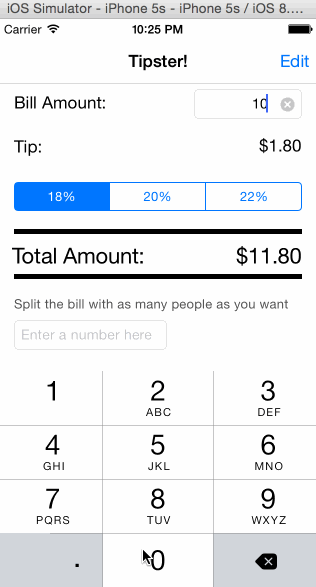

# Tipster

Tipster is a simple iOS app developed in Swift. It calculates the tips (which are 18%, 20%, or 22%) based on the total bill amount. The app also splits the bill amount into as many people as you like. 

Time spent: 4.5 hours spent in total

Completed user stories:

 * [x] Required: User can enter in the total bill amount (before tip)
 * [x] Required: User can decide how much he/she wants to tip - 18%, 20% or 22%
 * [x] Required: User can set up and save the default tip percentage to pay, which will be loaded whenever the app re-launches
 * [x] Optional: User can split the bill into as many people as he/she wants
 
Walkthrough of all user stories:

GIF created with [LiceCap](http://www.cockos.com/licecap/).
